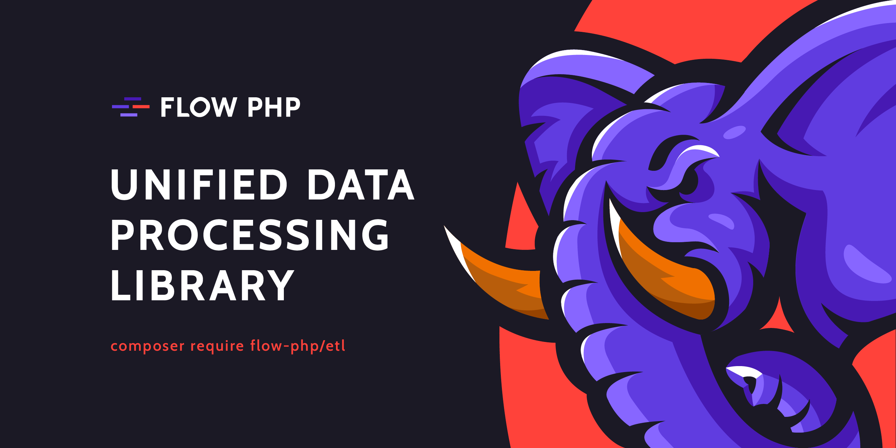

Flow is a PHP based, strongly typed data processing framework with low memory footprint.

Supported PHP versions:   

- ➡️ [Installation](installation.md)
- 📜 [Documentation](introduction.md)
- 📈 [Project Roadmap](https://github.com/orgs/flow-php/projects/1)
- 🛠️ [Contributing](../CONTRIBUTING.md)

> [!TIP]
> In case of any questions, feel free to join our  [Discrod Server](https://discord.gg/5dNXfQyACW)

# Table of contents 

- [ETL](components/core/core.md)
- Adapters
    - [chartjs](components/adapters/chartjs.md)
    - [csv](components/adapters/csv.md)
    - [doctrine](components/adapters/doctrine.md)
    - [elasticsearch](components/adapters/elasticsearch.md)
    - [google sheet](components/adapters/google-sheet.md)
    - [http](components/adapters/http.md)
    - [json](components/adapters/json.md)
    - [logger](components/adapters/logger.md)
    - [meilisearch](components/adapters/meilisearch.md)
    - [parquet](components/adapters/parquet.md)
    - [text](components/adapters/text.md)
    - [xml](components/adapters/xml.md)
- Libraries
    - [array-dot](components/libs/array-dot.md)
    - [azure-sdk](components/libs/azure-sdk.md)
    - [doctrine-dbal-bulk](components/libs/doctrine-dbal-bulk.md)
    - [dremel](components/libs/dremel.md)
    - [filesystem](components/libs/filesystem.md)
    - [parquet](components/libs/parquet.md)
    - [parquet-viewer](components/libs/parquet-viewer.md)
    - [snappy](components/libs/snappy.md)
- Bridges
    - [filesystem-azure](components/bridges/filesystem-azure-bridge.md)
    - [monolog-http](components/bridges/monolog-http-bridge.md) 

# Key Features

- **Low memory footprint**: Optimized for efficiency, Flow PHP ensures minimal memory usage, maintaining low and constant consumption regardless of data size. This makes it ideal for handling large datasets without compromising performance.
- **Versatile Data Source Interaction**: Whether your data resides in databases, spreadsheets, or online platforms, Flow PHP can seamlessly read from and write to any data source.
- **Rich Collection of Data Transformation Functions**: Transform your data with ease using a wide array of built-in functions. From simple mapping to complex manipulations, the framework covers all your data transformation needs.
- **Direct Access to Remote Filesystems**: Flow PHP provides the ability to interact directly with remote filesystems, facilitating efficient data handling and processing without the need for local storage.
- **Advanced Data Partitioning**: Efficiently partition your data for improved manageability and processing. This feature is crucial for handling large datasets or for processing data in distributed systems.
- **Grouping & Aggregating**: Easily group and aggregate data to extract meaningful insights. This feature is particularly useful for summarizing datasets and performing statistical analysis.
- **Remote File Processing**: Process files stored remotely with the same ease as local files, enabling powerful and flexible data integration from various sources.
- **Join Operations**: Perform join operations between different datasets. This is essential for combining data from multiple sources, providing a more comprehensive view.
- **Efficient Sorting**: Sort your data based on specific criteria or conditions, ensuring that your datasets are organized precisely as needed.
- **ASCII Table Display**: Visualize your datasets as neatly formatted ASCII tables, making it easier to read and analyze data directly from the console.
- **Schema Validation**: Ensure data quality and consistency by validating your datasets against predefined schemas.
- **Window Functions**: Utilize window functions for advanced data analysis, allowing you to perform calculations across sets of rows that are related to the current row.
- **Built-In Caching Mechanism**: Improve performance with built-in caching, reducing processing time and enhancing overall efficiency, especially in repetitive data processing tasks.

[⬅️️ Back](../README.md)
